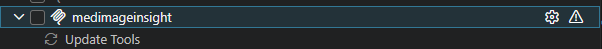
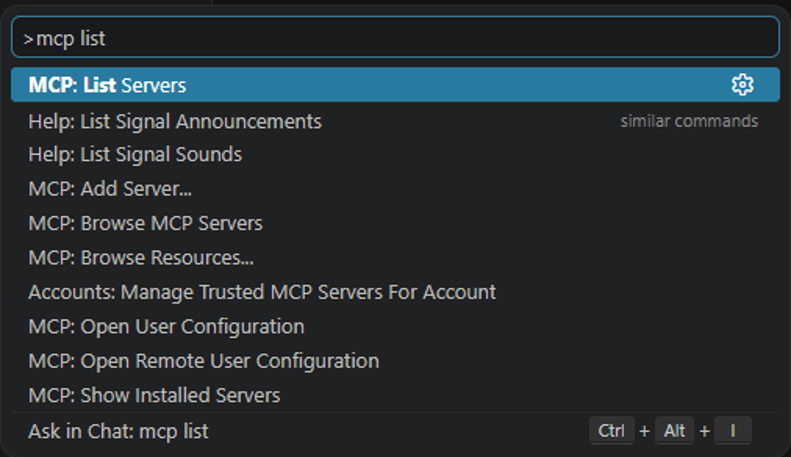
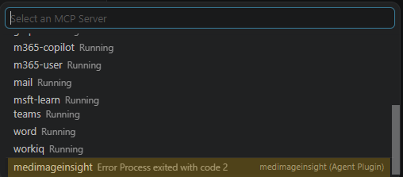
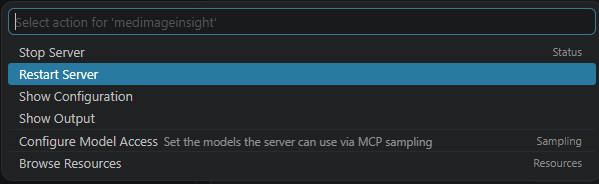

# Troubleshooting

## Setup and configuration

The classification tools (`zeroshot_classify`, `adapter_classify`) require `MI2_MODEL_ENDPOINT` to be set. This is a full AzureML online-endpoint resource ID. If the model is not deployed yet, see the [Healthcare AI deployment guide](https://github.com/microsoft/healthcareai-examples/blob/main/docs/deployment-guide.md).

**Check liveness.** Call `mcp_medimageinsig_zeroshot_label_examples`. This tool runs locally with no endpoint. If it returns label examples, the server process is running and importable.

**Configure the endpoint.** If a classification tool reports the server is not configured, call `mcp_medimageinsig_setup` with one of:

- `env_file`: path to a `.env` file containing `MI2_MODEL_ENDPOINT=<resource-id>`, or
- `endpoint`: the AzureML resource ID directly.

If the user has not provided either, ask for their `.env` file path. Do not ask for or handle API keys. The server fetches credentials from the endpoint itself.

---

## Tools don't appear in the tool picker

If `zeroshot_classify`, `adapter_classify`, `setup`, or `zeroshot_label_examples` are absent from the tool list under **medimageinsight**, or the group shows a warning icon:



1. Open your tool's MCP server log and look for a Python syntax error or import error logged on server start.
2. If the log shows `No such file or directory (os error 2)`, see **Server fails to start** below.
3. If the log is clean but tools are still missing, restart the MCP server (see **Restart the MCP server** below).

---

## First call is slow (30-90 seconds)

The AzureML endpoint may be cold-starting after a period of inactivity. Wait for the first call to complete. Subsequent calls are fast. This is expected behavior, not a bug.

---

## Agent wrote a report without calling MI2 first

If the agent writes a report and the trace shows no `mcp_medimageinsig_zeroshot_classify` or `mcp_medimageinsig_adapter_classify` call, the tool is not registered with the agent. Check that:

1. The tool appears in the tool picker under **medimageinsight** (see above).
2. The active chat is using the **Radiology Assistant** agent, not your default agent.

The Radiology Assistant is instructed to stop and report an error if a tool fails or is missing. If it wrote a report anyway without grounding, the tool was not visible to it.

---

## Adapter import errors (models/ path)

If the MCP server log shows an import error or a file-not-found error on `adapter_classify`:

- The adapter needs model bundles under a `models/` directory. Confirm `models/adapter_mlp/` and `models/adapter_svm/` exist, each containing `weights.joblib` and `thresholds.json`.
- These bundles ship with the plugin. If the directory is missing, the plugin installation may be incomplete.

---

## Server fails to start (os error 2 / backslash path)

**Symptom:** the `medimageinsight` MCP server fails to start. The log shows `error: No such file or directory (os error 2)`, exit code 2 — and if you look closely at the path in the log, it has **backslashes**, e.g. `\home\<user>\.copilot\installed-plugins\...\mcp-server` instead of `/home/<user>/...`.

**Cause — a known VS Code bug, not a plugin error.** When VS Code runs over **Remote-SSH or WSL with a Windows client**, it hands the plugin's MCP server an unusable path: `${CLAUDE_PLUGIN_ROOT}` arrives with **Windows backslashes** (`\home\...`, which is invalid on Linux), and the working directory is set to the home folder instead of the plugin root. Either way `uv` cannot find `mcp-server/` and the server exits.

Tracked upstream in VS Code (open at time of writing):

- [microsoft/vscode#323475](https://github.com/microsoft/vscode/issues/323475) — plugin+mcp paths not substituted/normalized; cwd set to home.
- [microsoft/vscode#318915](https://github.com/microsoft/vscode/issues/318915) — support `PLUGIN_ROOT` in `.mcp.json`.
- Related, closed as duplicate: [microsoft/vscode#313201](https://github.com/microsoft/vscode/issues/313201) — WSL backslash path not normalized.

**Not affected:** Copilot CLI, and native (non-remote) Linux, macOS, and Windows.

**Workaround (local, do not commit).** Edit the INSTALLED plugin's `.mcp.json` — not the repo source — to hardcode an absolute `--directory`. This is machine-specific, so it only belongs in the installed copy:

```json
"args": ["run", "--directory", "/home/<user>/.copilot/installed-plugins/healthcareai-examples/medimageinsight/mcp-server", "python", "server.py"]
```

Replace `/home/<user>/...` with the real installed path, then restart the server (see **Restart the MCP server** below).


---

## Restart the MCP server

After a config change, or when the server crashed on start, restart it. In VS Code:

1. Open the Command Palette and run **MCP: List Servers**.

   

2. Select **medimageinsight**. If it crashed, you will see an error next to it (for example, "Process exited with code 2").

   

3. Choose **Restart Server**.

   

Then reopen the tool picker and confirm the four tools appear under **medimageinsight**.

---

## Smoke test

Run the bundled smoke test to check each tool against the live endpoint.

1. Resolve the absolute path of `../../mcp-server/` from this skill's own directory.
2. Get the user's `.env` file path. If they have none, ask (or accept a direct endpoint resource ID with `--endpoint <resource-id>`).
3. Run:

   ```bash
   uv run --directory <abs mcp-server path> python smoketest.py --env-file <env path>
   ```

   Optional flags: `--image <path>` to test a specific image; `--quiet` for summary-only output.

4. Report the per-tool pass/fail result. If it reports "not configured," see **Setup and configuration** above.
