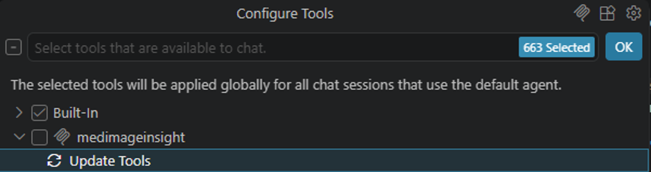
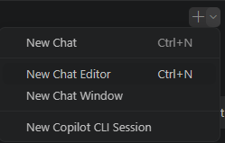
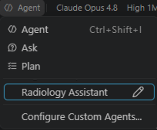

# Walkthrough: first report

A guided first run with MedImageInsight. Keep **this chat** open as your tutor: follow the steps, and if anything goes wrong, paste what you see here and ask.

## Prerequisites

- The MedImageInsight plugin is installed.
- The MedImageInsight model is deployed, and you have either its AzureML endpoint resource ID or a `.env` file that sets `MI2_MODEL_ENDPOINT`.
  - **Already ran the [healthcareai-examples](https://github.com/microsoft/healthcareai-examples) notebooks?** You are set. Reuse the same `.env` from that repo, it already has `MI2_MODEL_ENDPOINT`.
  - **Starting fresh?** Deploy the model with the [Healthcare AI deployment guide](https://github.com/microsoft/healthcareai-examples/blob/main/docs/deployment-guide.md) (or the [manual deployment guide](https://github.com/microsoft/healthcareai-examples/blob/main/docs/manual-deployment.md)). Deployment writes `MI2_MODEL_ENDPOINT` into your `.env`.

**What we will do:**

1. Confirm the MedImageInsight tools are running, and fix them if they are not.
2. Run setup so the tools can reach the model.
3. Open a working chat and point it at the **Radiology Assistant** agent.
4. Ask for a report on a sample image and look at what comes back.

Steps 1 and 2 happen right here in this tutor chat, and you only do them once.

---

## Step 1: Check the MCP server is running

Open the tool picker (**Configure Tools**, the tools icon near the model selector). Find the **medimageinsight** group and make sure it is turned on. If the group is empty or stale, click **Update Tools** to refresh it.



These tools apply to every chat that uses the default agent, so enabling them here also lets this tutor chat use them. Under **medimageinsight** you should see four tools:

- `zeroshot_classify`
- `adapter_classify`
- `setup`
- `zeroshot_label_examples`

**If they appear:** move to Step 2.

**If a warning icon shows on the medimageinsight group, or the tools do not appear:** the MCP server is not running, or it crashed on start. Ask for help right here:

```
/medimageinsight help the mcp server is not working
```

The tutor will diagnose it and walk you through the fix. A common cause is a missing `cwd` in the installed MCP config, which is a one-line change plus a server restart. For the full list of causes and fixes, see [troubleshooting.md](skills/help/references/troubleshooting.md).

---

## Step 2: Run setup

The tools need an endpoint before they can classify anything. In this chat, run setup:

```
Run setup with endpoint <your endpoint resource ID>.
```

The endpoint is a full AzureML resource ID:

```
/subscriptions/<id>/resourceGroups/<rg>/providers/Microsoft.MachineLearningServices/workspaces/<ws>/onlineEndpoints/<name>
```

That single ID already contains the subscription, resource group, and workspace. The agent passes it straight to `setup` as-is. It does not need to look anything up, run `az`, or ask you for those parts separately.

> [!TIP]
> If you have a `.env` file that sets `MI2_MODEL_ENDPOINT`, ask instead: `Run setup with the env file at <path to your .env file>.`

> [!NOTE]
> Do not have an endpoint yet? Deploy the MedImageInsight model with the [Healthcare AI deployment guide](https://github.com/microsoft/healthcareai-examples/blob/main/docs/deployment-guide.md), then come back to this step.

You should get a confirmation like:

```
MedImageInsight configured for <host>. All tools are ready.
```

> [!IMPORTANT]
> No API key is asked for or echoed. Credentials come from the endpoint itself.

---

## Step 3: Open the working chat

Now that the tools are configured, open a second chat for the actual report. Setup carries over: it configures the shared MedImageInsight server, so the working chat is ready to go.

- **This chat (tutor):** keep it open for questions and troubleshooting.
- **The working chat:** where you talk to the Radiology Assistant agent.

Open a new chat window. In VS Code, the `+` menu at the top of the Chat view has a **New Chat Window** option (your tool may differ):



Switch its agent selector to **Radiology Assistant**:



---

## Step 4: Generate a report

In the working chat, ask for a report on a sample image:

```
Please write a radiology report for https://media.githubusercontent.com/media/microsoft/healthcareai-examples-data/main/medimageinsight/plugin-samples/00026132_011.png
```

**What you should see:**

1. One `zeroshot_classify` tool call. This is the MI2 grounding step: the agent asks the model what is in the image.
2. The `write-report` skill invoked to turn those findings into a report.
3. A final answer with two blocks: an `<info>` block with the grounding details, and a clean `<report>` block.

The answer looks like this:

```
<info>
Grounding: zero-shot (ChestX-ray14 label set)
Positive: Effusion (0.58), Cardiomegaly (0.41)
Possible: Atelectasis (0.13)
Negative: all other labels below threshold
</info>
<report>
INDICATION: Not provided.
TECHNIQUE: Frontal chest radiograph.
FINDINGS: Blunting of the costophrenic angle with a small layering pleural effusion. The cardiac silhouette is enlarged. Mild basal atelectasis cannot be excluded. The remaining lungs are clear. No pneumothorax. No acute osseous abnormality. No support devices.
IMPRESSION:
1. Small pleural effusion.
2. Cardiomegaly.
3. Possible mild basal atelectasis.
</report>
```

> [!NOTE]
> The `<report>` block reads like a radiologist wrote it: no probability scores, no mention of MI2, no classifier names. All of that stays in the `<info>` block above it.

> [!NOTE]
> The first call can take 30 to 90 seconds while the endpoint warms up after inactivity. This is expected; later calls are fast.

> [!WARNING]
> If the agent writes a report without making a `zeroshot_classify` call first, the tools are not registered with the agent. See [troubleshooting.md](skills/help/references/troubleshooting.md).

> [!IMPORTANT]
> Reports produced here are research and educational examples only, not for clinical use.

---

## What you have now

- [ ] A working chat running the **Radiology Assistant** agent.
- [ ] The four **medimageinsight** tools visible in the tool picker.
- [ ] A configured endpoint (you saw the "All tools are ready" confirmation).
- [ ] A report whose trace shows one `zeroshot_classify` call, then `write-report`.

That is the full flow. To generate another report, just send a new prompt with a different image path.

**Next steps:** for the adapter path (pre-bucketed positive / possible / negative findings) and more on how MI2 grounding works, see [about.md](skills/help/references/about.md). For error help, see [troubleshooting.md](skills/help/references/troubleshooting.md).
